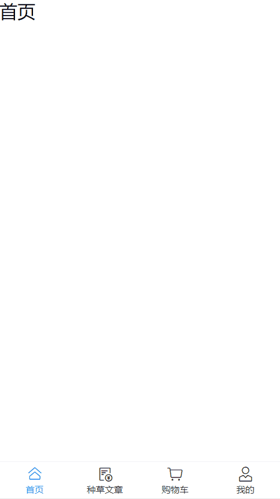

## 构建项目

### 初始化项目


### 配置vant

```sh
# Vue 3 项目，安装最新版 Vant
npm i vant

# 自动引入插件
npm i unplugin-vue-components -D
```

vite.config.js

```js
import { fileURLToPath, URL } from 'node:url';
import { defineConfig } from 'vite';
import vue from '@vitejs/plugin-vue';
import vueJsx from '@vitejs/plugin-vue-jsx';
import Components from 'unplugin-vue-components/vite';
import { VantResolver } from 'unplugin-vue-components/resolvers';

// https://vitejs.dev/config/
export default defineConfig({
  base: './',
  plugins: [
    vue(),
    vueJsx(),
    Components({
      resolvers: [VantResolver()],
    }),
  ],
  resolve: {
    alias: {
      '@': fileURLToPath(new URL('./src', import.meta.url)),
    },
  },
});
```

src\main.js 导入函数组件样式

```js
// Toast
import 'vant/es/toast/style';
// Dialog
import 'vant/es/dialog/style';
// Notify
import 'vant/es/notify/style';
// ImagePreview
import 'vant/es/image-preview/style';
```

### 配置scss

```sh
npm i -D sass
```

### 配置rem移动端适配

安装postcss

```sh
npm i -D postcss-preset-env postcss-pxtorem postcss
```

新建文件 ./postcss.config.js

```js
// postcss.config.js
module.exports = {
  plugins: {
    /**
     * 自动px转rem
     */
    'postcss-pxtorem': {
      // 一个元素是75px   ===>   2rem
      rootValue: 37.5,
      propList: ['*'],
    },
    /**
     * 自动配置浏览器样式
     */
    'postcss-preset-env': {},
  },
};

```

### rem适配

src\assets\flexible.js

```js
// 首先是一个立即执行函数，执行时传入的参数是window和document
(function flexible(window, document) {
  var docEl = document.documentElement; // 返回文档的root元素
  var dpr = window.devicePixelRatio || 1;
  // 获取设备的dpr，即当前设置下物理像素与虚拟像素的比值
  // 调整body标签的fontSize，fontSize = (12 * dpr) + 'px'
  // 设置默认字体大小，默认的字体大小继承自body
  function setBodyFontSize() {
    if (document.body) {
      document.body.style.fontSize = 12 * dpr + 'px';
    } else {
      document.addEventListener('DOMContentLoaded', setBodyFontSize);
    }
  }
  setBodyFontSize();
  // set 1rem = viewWidth / 10
  // 设置root元素的fontSize = 其clientWidth / 10 + ‘px’
  function setRemUnit() {
    var rem = docEl.clientWidth / 10;
    docEl.style.fontSize = rem + 'px';
  }
  // 移动端的适配如何做
  // (1): 所有的css单位, rem    (vscode可以自动把px转成rem, pxtorem插件设置基准值37.5) - 1rem等于37.5px
  //  原理: rem要根据html的font-size换算
  //  目标: 网页宽度变小, html的font-size也要变小, ...网页变大, html的font-size变大.
  // (2): flexible.js (专门负责当网页宽度改变, 会修改html的font-size)
  setRemUnit();
  // 当我们页面尺寸大小发生变化的时候，要重新设置下rem 的大小
  window.addEventListener('resize', setRemUnit);
  // pageshow 是我们重新加载页面触发的事件
  window.addEventListener('pageshow', function (e) {
    // e.persisted 返回的是true 就是说如果这个页面是从缓存取过来的页面，也需要从新计算一下rem 的大小
    if (e.persisted) {
      setRemUnit();
    }
  });
  // 检测0.5px的支持，支持则root元素的class中有hairlines
  if (dpr >= 2) {
    var fakeBody = document.createElement('body');
    var testElement = document.createElement('div');
    testElement.style.border = '.5px solid transparent';
    fakeBody.appendChild(testElement);
    docEl.appendChild(fakeBody);
    if (testElement.offsetHeight === 1) {
      docEl.classList.add('hairlines');
    }
    docEl.removeChild(fakeBody);
  }
})(window, document);
export {};
```

src\assets\reset.css 重置样式

```css
body, div, dl, dt, dd, ul, ol, li, h1, h2, h3, h4, h5, h6, pre, form, fieldset, input, textarea, p, blockquote, th, td {
    padding: 0;
    margin: 0;
}

table {
    border-collapse: collapse;
    border-spacing: 0;
}

fieldset, img {
    border: 0;
}

address, caption, cite, code, dfn, em, strong, th, var {
    font-weight: normal;
    font-style: normal;
}

ol, ul {
    list-style: none;
}

caption, th {
    text-align: left;
}

h1, h2, h3, h4, h5, h6 {
    font-weight: normal;
    font-size: 100%;
}

q:before, q:after {
    content: '';
}

abbr, acronym {
    border: 0;
}
```

main.js

```js
// 引入flexible 适配
import "./assets/flexible"
// 导入重置样式
import "./assets/reset.css"
```

### 配置jsconfig

jsconfig.json	开启路径别名提示

```js
{
  "compilerOptions": {
    "module": "ESNext",
    "moduleResolution": "Node",
    "target": "ESNext",
    "jsx": "react",
    "strictNullChecks": true,
    "strictFunctionTypes": true,
    "baseUrl": ".",
    "paths": {
      "@/*": ["./src/*"]
    }
  },
  "include": ["src/**/*", "src/**/*.vue"],
  "exclude": ["node_modules", "**/node_modules/*"]
}
```

## TabBar组件

src\components\TabBar.vue

```vue
<script setup>
import { ref } from 'vue';

/**
 * 选中index
 */
const active = ref(0);
</script>

<template>
  <div>
    <van-tabbar v-model="active" route>
      <van-tabbar-item icon="home-o" to="/home" replace>首页</van-tabbar-item>
      <van-tabbar-item icon="balance-list-o" to="/recommend" replace
        >种草文章</van-tabbar-item
      >
      <van-tabbar-item icon="cart-o" to="/cart" replace>购物车</van-tabbar-item>
      <van-tabbar-item icon="user-o" to="/user" replace>我的</van-tabbar-item>
    </van-tabbar>
  </div>
</template>

<style lang="scss" scoped></style>
```

### 配置路由

src\router\index.js 	更换为hash路由并替换路由规则

```js
import { createRouter, createWebHashHistory } from 'vue-router';

const router = createRouter({
  history: createWebHashHistory(import.meta.env.BASE_URL),
  routes: [
    {
      path: '/',
      name: 'root',
      redirect: '/home',
    },
    {
      path: '/home',
      name: 'home',
      component: () => import('@/views/Home.vue'),
      meta: {
        isShowNav: true,
      },
    },
    {
      path: '/recommend',
      name: 'recommend',
      component: () => import('@/views/Recommend.vue'),
      meta: {
        isShowNav: true,
      },
    },
    {
      path: '/cart',
      name: 'cart',
      component: () => import('@/views/Cart.vue'),
      meta: {
        isShowNav: true,
      },
    },
    {
      path: '/user',
      name: 'user',
      component: () => import('@/views/User.vue'),
      meta: {
        isShowNav: true,
      },
    },
    // 访问没有的路由直接跳往首页
    {
      path: '/:toHome*',
      name: 'toHome',
      redirect: '/home',
    },
  ],
});

export default router;
```

对应文件如下

src\views\Cart.vue

```vue
<template>
  <div>
    购物车
  </div>
</template>
```

src\views\Home.vue

```vue
<template>
  <div>首页</div>
</template>
```

src\views\Recommend.vue

```vue
<template>
  <div>
    种草文章
  </div>
</template>
```

src\views\User.vue

```vue
<template>
  <div>我的</div>
</template>
```

### 在App.vue中引入使用

```vue
<script setup>
import { ref, watch } from 'vue';
import { RouterView ,useRoute} from 'vue-router';
import TabBar from './components/TabBar.vue';

/**
 * vue3路由用法相当于$route,返回当前路由地址
 */
const route = useRoute();

/**
 * 新建一个响应式数据来控制组件的存在
 */
const isShowNav = ref(false);

// 监视路由变动，然后控制TabBar组件的存在
watch(route, newVal => {
  isShowNav.value = newVal.meta.isShowNav;
});
</script>

<template>
  <div id="app">
    <RouterView />
    <!-- 在TabBar组件上控制 -->
    <TabBar v-if="isShowNav" />
  </div>
</template>
```

### 效果如下



## axios配置

安装axios

```sh
npm i axios
```

src\utils\request.js

```js
import axios from 'axios';

const request = axios.create({
  /**
   * 服务基本网址
   */
  baseURL: 'http://124.220.178.79:8199',
  /**
   * 超时
   */
  timeout: 15000,
});

export default request;
```

配置基本的返回拦截器

```js
// 添加响应拦截器
request.interceptors.response.use(
  res => res.data,
  error => Promise.reject(error)
);
```

### api接口配置

src\api\home.js

```js
import { query } from '@/utils/query';
import request from '@/utils/request';

/**
 * @description 获取轮播图数据
 * @param {{limit:number,page:number}} queryObj
 */
export const getCarouselChartData = queryObj =>
  request({
    method: 'POST',
    url: '/frontend/rotation/list'.concat('?', query(queryObj)),
  });
```

我们需要封装一个工具函数把json对象转成query字符串

src\utils\query.js

```js
/**
 * @description 对象转query字符串
 * @param {Record<string,any>} queryObj
 * @return {string}
 */
export const query = queryObj =>
  Object.keys(queryObj)
    .map(key =>
      key.concat(
        '=',
        typeof queryObj[key] === 'string'
          ? queryObj[key]
          : JSON.stringify(queryObj[key])
      )
    )
    .join('&');

```

## 首页